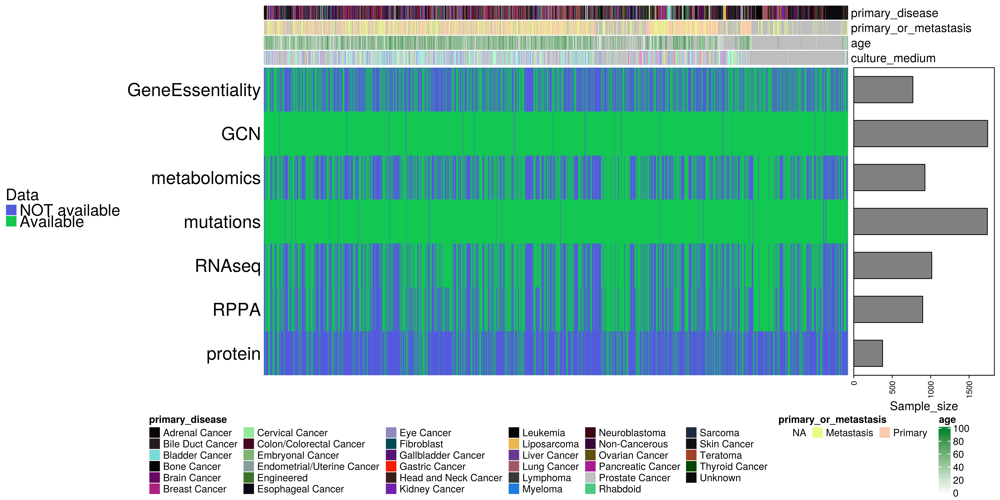
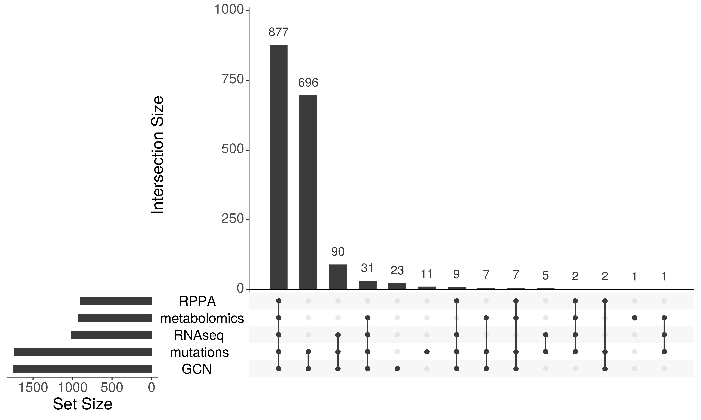

Build a MultiAssayExperiment from CCLE multi-omics data
================
Javier Perales-Patón -
<a href="mailto:javier.perales@bioquant.uni-heidelberg.de" class="email">javier.perales@bioquant.uni-heidelberg.de</a>
- ORCID: 0000-0003-0780-6683

Environment
-----------

### File structure

    options(stringsAsFactors = FALSE)
    # Seed number
    set.seed(1234)

    # input dir
    INDIR <- "./raw/"

    # Output directory
    OUTDIR <- "./data/"
    if(!dir.exists(OUTDIR)) dir.create(OUTDIR);

    # Figures
    FIGDIR <- "./fig/"
    knitr::opts_chunk$set(fig.path=FIGDIR)
    knitr::opts_chunk$set(dev=c('png'))

    # Data
    DATADIR <- OUTDIR
    if(!dir.exists(DATADIR)) dir.create(DATADIR);

    # If already exists, clean dirs?
    clean_dirs <- TRUE
    if(clean_dirs) {
        unlink(list.files(DATADIR, full.names=TRUE, recursive = TRUE))
        unlink(list.files(FIGDIR, full.names=TRUE, recursive = TRUE))
    }

### Libraries

    # library(Biobase)
    suppressPackageStartupMessages(library(SummarizedExperiment))
    suppressPackageStartupMessages(library(RaggedExperiment))
    suppressPackageStartupMessages(library(MultiAssayExperiment))
    suppressPackageStartupMessages(library(reshape2))
    suppressPackageStartupMessages(library(UpSetR))
    suppressPackageStartupMessages(library(ComplexHeatmap))

Read data
---------

The following raw data was obtained directly from CCLE’s FTP repository
after accepting its LICENSE, and the DepMap’s FigShare, or custom
laboratories websites. Use `make` to get all raw data.

    ## Omics
    fls <- list.files(INDIR, pattern="\\.(csv|gct)(\\.gz)?", full.names = TRUE)
    fls <- grep("info", fls, invert=TRUE, value=TRUE)
    names(fls) <- sapply(gsub("^CCLE_", "", basename(fls)), function(z) strsplit(z, split="_")[[1]][1])
    names(fls) <- gsub("\\.(csv|gct)(\\.gz)?","", names(fls))

    ## Info
    ifls <- list.files(INDIR, pattern=".*info.*\\.(csv|gct)(\\.gz)?", full.names = TRUE)
    names(ifls) <- sapply(gsub("^CCLE_", "", basename(ifls)), function(z) strsplit(z, split="_")[[1]][1])

    # Show which omics and files
    print(fls)

    ##                                      metabolomics 
    ##           "./raw//CCLE_metabolomics_20190502.csv" 
    ##                                         mutations 
    ##                       "./raw//CCLE_mutations.csv" 
    ##                                            RNAseq 
    ## "./raw//CCLE_RNAseq_genes_counts_20180929.gct.gz" 
    ##                                              RPPA 
    ##                   "./raw//CCLE_RPPA_20181003.csv" 
    ##                                           protein 
    ##  "./raw//protein_quant_current_normalized.csv.gz"

    read_raw <- function(fl, omic) {
        if(omic == "metabolomics") {
            tab <- read.table(fl, sep=",", header=TRUE, 
                      stringsAsFactors = FALSE, 
                      check.names = FALSE)
        } else if (omic == "mutations") {
            tab <- read.table(fl, sep="\t", header=TRUE,
                      stringsAsFactors = FALSE,
                      check.names = FALSE)
        } else if (omic == "RNAseq") {
            tab <- read.table(fl, sep="\t", header=TRUE,
                      stringsAsFactors = FALSE,
                      check.names = FALSE,
                      skip = 2)
        } else if (omic == "RPPA") {
            tab <- read.table(fl, sep=",", header=TRUE, 
                      stringsAsFactors = FALSE, 
                      check.names = FALSE)
        } else if (omic == "protein") {
            tab <- read.table(fl, sep=",", header=TRUE, 
                      stringsAsFactors = FALSE, 
                      check.names = FALSE)
        } else {
            stop("OMIC not supported")
        }
        return(tab)

    }

    meta <- read.table(ifls["sample"], sep=",", header=TRUE,quote = '"',
               stringsAsFactors = FALSE, check.names=FALSE)
    stopifnot(!any(duplicated(meta$CCLE_Name)))
    rownames(meta) <- meta$CCLE_Name
    # meta_int <- c("DepMap_ID", "COSMICID", "sex", "culture_type", "culture_medium", 
    #     "sample_collection_site", "primary_or_metastasis", "primary_disease", 
    #     "Subtype", "age", "Sanger_Model_ID")
    DepMap2CCLE <- setNames(meta$CCLE_Name, meta$DepMap_ID)

Process data
------------

    for(omic in names(fls)) {
        if(omic == "metabolomics") {
            tab <- read_raw(fls[omic], omic)
            rownames(tab) <- tab$CCLE_ID
            tab <- t(tab[, -c(1:2) ])
            res <- as.matrix(tab)
        } else if (omic == "mutations") {
            tab <- read_raw(fls[omic], omic)
            tab$Tumor_Sample_Barcode <- DepMap2CCLE[tab$Tumor_Sample_Barcode]
            # Inspired by: https://github.com/waldronlab/MultiAssayExperiment-CCLE/blob/master/R/ccleMAEO.R#L106-L113
            res <- makeGRangesListFromDataFrame(tab,
                                          names.field = "Hugo_Symbol",
                                          split.field = "Tumor_Sample_Barcode",
                                          start.field = "Start_position",
                                          end.field = "End_position",
                                          keep.extra.columns = TRUE)

            res <- RaggedExperiment(res)

        } else if (omic == "RNAseq") {
            tab <- read_raw(fls[omic], omic)
            # We focus on gene symbol. Remove first column (ensembl_gene_id). Then
            # aggregate counts by summing them by gene symbol
            tab <- tab[, which(colnames(tab)!="Name")]
            tab <- aggregate(.~ Description, data=tab, sum)
            # Rename rows, remove extra column, transform into matrix
            rownames(tab) <- tab$Description
            tab <- tab[, which(colnames(tab)!="Description")]
            res <- as.matrix(tab)

        } else if (omic == "RPPA") {
            tab <- read_raw(fls[omic], omic)
            rownames(tab) <- tab[,1]
            tab <- t(tab[, -c(1) ])
            # Here read rowdat from info file
            rowDat <- read.table(ifls[omic], sep=",", header=TRUE,
                       stringsAsFactors = FALSE,
                       check.names = FALSE)
            rownames(rowDat) <- rowDat$Antibody_Name

            res <- SummarizedExperiment(assay=setNames(list(tab), omic),
    #                      colData = colDat,
                           rowData = rowDat)
        } else if (omic == "protein") {
            tab <- read_raw(fls[omic], omic)
            # Generate rowData
            rowDat <- tab[, 1:48]

            # Reformat mat
            tab <- tab[-c(1:48)]

            # Generate colData
            colDat <- sapply(colnames(tab),function(z) {
                         xx <- strsplit(z,split="_")[[1]]
                        batch <- tail(xx,1)
                        cellID <- paste(setdiff(xx, batch),collapse="_")
                        return(c(cellID, batch))
                      })
            colDat <- as.data.frame(t(colDat))
            colnames(colDat) <- c("cellID","batch")
            # Init Nreplicates of instances
            colDat$Nreplicates <- 1

            # Handle replicates by average them
            if(any(duplicated(colDat$cellID))) {
                DupCellID <- colDat$cellID[duplicated(colDat$cellID)]
                cat(paste0("CL w/ >1 replicate: ", 
                       paste(DupCellID,collapse=","), 
                       "\n"),file=stdout())
                for(CL in DupCellID) {
                    # Collect all index for cellID,
                    # retrieve 1st to summarize as average
                    # remove the rest
                    CL.idx <- which(colDat$cellID==CL)
                    CL.idx_1st <- CL.idx[1]
                    CL.idx_rm <- CL.idx[-1]

                    # Average signal
                    tab[, CL.idx_1st] <- apply(tab[, CL.idx],1, function(z) mean(z, na.rm=TRUE))
                    # Concatenate batches
                    colDat[CL.idx_1st, "batch"] <- paste(colDat[CL.idx, "batch"], collapse=",")
                    # Count N replicates
                    colDat[CL.idx_1st, "Nreplicates"] <- sum(colDat[CL.idx, "Nreplicates"])

                    # Remove replicates
                    tab <- tab[, -CL.idx_rm]
                    colDat <- colDat[-CL.idx_rm, ]

                }
            }
            rownames(colDat) <- colDat$cellID
            colnames(tab) <- colDat[colnames(tab), "cellID"]

            res <- SummarizedExperiment(assay=setNames(list(tab), omic),
                           colData = colDat,
                           rowData = rowDat)
        } else {
            stop("OMIC not supported")
        }

        assign(omic, res)
    }

    ## CL w/ >1 replicate: SW948_LARGE_INTESTINE,CAL120_BREAST,HCT15_LARGE_INTESTINE

MultiAssayExperiment : create and save it
-----------------------------------------

    omics <- names(fls)
    # Experiment List ----
    dataList <- sapply(omics, get)
    # Prepare the MultiAssayExperiment
    MAE <- MultiAssayExperiment(experiments=dataList,
                    colData=meta)

    ## Warning: Data dropped from ExperimentList (element - column):
    ##  metabolomics - KE97_HAEMATOPOIETIC_AND_LYMPHOID_TISSUE
    ##  metabolomics - NCIH684_LIVER...
    ##  RPPA - KE97_HAEMATOPOIETIC_AND_LYMPHOID_TISSUE
    ##  RPPA - NCIH684_LIVER
    ## Unable to map to rows of colData

    ## harmonizing input:
    ##   removing 63 colData rownames not in sampleMap 'primary'

    print(MAE)

    ## A MultiAssayExperiment object of 5 listed
    ##  experiments with user-defined names and respective classes.
    ##  Containing an ExperimentList class object of length 5:
    ##  [1] metabolomics: matrix with 225 rows and 926 columns
    ##  [2] mutations: RaggedExperiment with 794376 rows and 1738 columns
    ##  [3] RNAseq: matrix with 54271 rows and 1015 columns
    ##  [4] RPPA: SummarizedExperiment with 214 rows and 897 columns
    ##  [5] protein: SummarizedExperiment with 12755 rows and 375 columns
    ## Features:
    ##  experiments() - obtain the ExperimentList instance
    ##  colData() - the primary/phenotype DFrame
    ##  sampleMap() - the sample availability DFrame
    ##  `$`, `[`, `[[` - extract colData columns, subset, or experiment
    ##  *Format() - convert into a long or wide DFrame
    ##  assays() - convert ExperimentList to a SimpleList of matrices

    saveRDS(MAE, paste0(DATADIR,"/MAE.rds"))
    # Save features per each omic
    for(omic in names(assays(MAE))) {
        cat(rownames(assay(MAE, "metabolomics")),sep="\n",
            file=paste0(DATADIR,"/features_",omic,".txt"))
    }

    sMap <- sampleMap(MAE)
    write.table(as.data.frame(sMap), file=paste0(DATADIR,"/sample_map.csv"),
            sep=",", row.names=FALSE, col.names=TRUE, quote=TRUE)

Visualization
-------------

    set.seed(1213)
    MAT <- reshape2::dcast(as.data.frame(sMap), primary ~ assay)

    ## Using colname as value column: use value.var to override.

    MAT <- MAT[,-1]
    rownames(MAT) <- apply(MAT, 1, function(z) unique(na.omit(z)))
    MAT[!is.na(MAT)] <- "Available"
    MAT[is.na(MAT)] <- "NOT available"
    MAT <- t(MAT)

    df <- colData(MAE)[,c("primary_disease", "primary_or_metastasis",
                  "age", "culture_medium")]
    hc <- HeatmapAnnotation(df=df, 
                annotation_legend_param = list(ncol=6),
                show_legend = c(TRUE, TRUE, TRUE, FALSE))
    ha <- rowAnnotation("Sample_size"=anno_barplot(rowSums(MAT=="Available")),
                annotation_width=unit(5, "cm"))
    hp <- Heatmap(MAT,name="Data",
              row_names_gp = gpar(fontsize=18),
            heatmap_legend_param = list(title_gp=gpar(fontsize=16),
                        labels_gp=gpar(fontsize=16)),
              show_row_names=TRUE, show_column_names=FALSE, 
              row_names_side="left", top_annotation = hc) + ha
    draw(hp, heatmap_legend_side="left", annotation_legend_side="bottom")

<!-- -->

    listInput <- split(sMap$primary, sMap$assay)
    upset(fromList(listInput), order.by = "freq", text.scale=2)

<!-- --> \#\# Session info

    sessionInfo()

    ## R version 4.0.2 (2020-06-22)
    ## Platform: x86_64-conda_cos6-linux-gnu (64-bit)
    ## Running under: Ubuntu 18.04.3 LTS
    ## 
    ## Matrix products: default
    ## BLAS/LAPACK: /home/jperales/dev/prepare_CCLE/envs/mae/lib/libopenblasp-r0.3.10.so
    ## 
    ## locale:
    ##  [1] LC_CTYPE=en_US.UTF-8       LC_NUMERIC=C              
    ##  [3] LC_TIME=en_GB.UTF-8        LC_COLLATE=en_US.UTF-8    
    ##  [5] LC_MONETARY=en_GB.UTF-8    LC_MESSAGES=en_US.UTF-8   
    ##  [7] LC_PAPER=en_GB.UTF-8       LC_NAME=C                 
    ##  [9] LC_ADDRESS=C               LC_TELEPHONE=C            
    ## [11] LC_MEASUREMENT=en_GB.UTF-8 LC_IDENTIFICATION=C       
    ## 
    ## attached base packages:
    ##  [1] grid      parallel  stats4    stats     graphics  grDevices utils    
    ##  [8] datasets  methods   base     
    ## 
    ## other attached packages:
    ##  [1] ComplexHeatmap_2.4.2        UpSetR_1.4.0               
    ##  [3] reshape2_1.4.4              MultiAssayExperiment_1.14.0
    ##  [5] RaggedExperiment_1.12.0     SummarizedExperiment_1.18.1
    ##  [7] DelayedArray_0.14.0         matrixStats_0.56.0         
    ##  [9] Biobase_2.48.0              GenomicRanges_1.40.0       
    ## [11] GenomeInfoDb_1.24.0         IRanges_2.22.1             
    ## [13] S4Vectors_0.26.0            BiocGenerics_0.34.0        
    ## 
    ## loaded via a namespace (and not attached):
    ##  [1] shape_1.4.4            circlize_0.4.10        GetoptLong_1.0.2      
    ##  [4] tidyselect_1.1.0       xfun_0.16              purrr_0.3.4           
    ##  [7] lattice_0.20-41        colorspace_1.4-1       vctrs_0.3.2           
    ## [10] generics_0.0.2         htmltools_0.5.0        yaml_2.2.1            
    ## [13] rlang_0.4.7            pillar_1.4.6           glue_1.4.1            
    ## [16] RColorBrewer_1.1-2     GenomeInfoDbData_1.2.3 lifecycle_0.2.0       
    ## [19] plyr_1.8.6             stringr_1.4.0          zlibbioc_1.34.0       
    ## [22] munsell_0.5.0          gtable_0.3.0           GlobalOptions_0.1.2   
    ## [25] evaluate_0.14          labeling_0.3           knitr_1.29            
    ## [28] Rcpp_1.0.4.6           scales_1.1.1           XVector_0.28.0        
    ## [31] farver_2.0.3           gridExtra_2.3          rjson_0.2.20          
    ## [34] ggplot2_3.3.2          png_0.1-7              digest_0.6.25         
    ## [37] stringi_1.4.6          dplyr_1.0.1            clue_0.3-57           
    ## [40] tools_4.0.2            bitops_1.0-6           magrittr_1.5          
    ## [43] RCurl_1.98-1.2         tibble_3.0.3           cluster_2.1.0         
    ## [46] crayon_1.3.4           pkgconfig_2.0.3        ellipsis_0.3.1        
    ## [49] Matrix_1.2-18          rmarkdown_2.3          R6_2.4.1              
    ## [52] compiler_4.0.2

    {                                                                                                                                                                                                           
    sink(file=paste0(OUTDIR,"/sessionInfo.txt"))
    print(sessionInfo())
    sink()
    }
